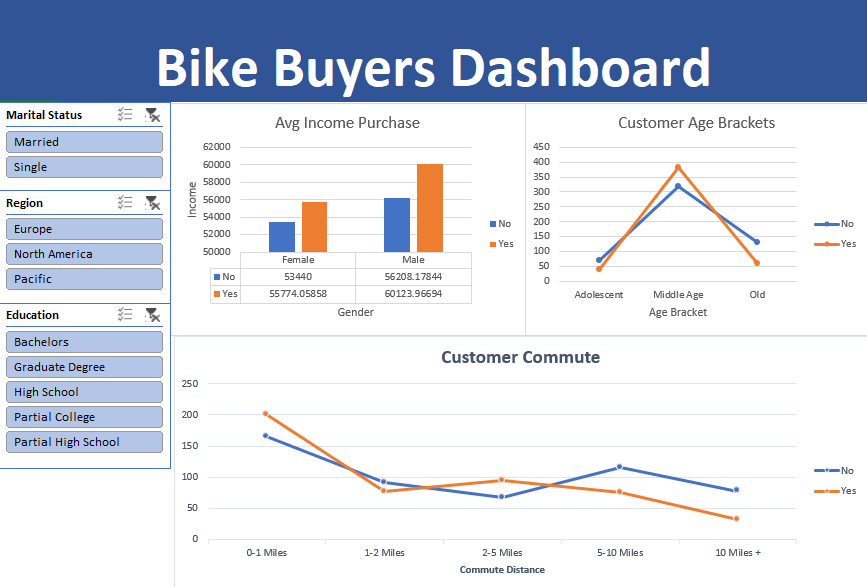

# Bike Ownership Analysis Dashboard

This project demonstrates the development of an interactive business intelligence dashboard using Excel. Using PivotTables, PivotCharts, and slicers, the dashboard enables users to explore demographic and behavioral factors associated with bike ownership across multiple dimensions.

The project illustrates how Excel can be used to build dynamic analytical dashboards that support exploratory analysis and interactive reporting.

## Technologies
- Microsoft Excel
- PivotTables
- PivotCharts
- Slicers
- Data Visualization

## Data Source

The data used for this dashboard was obtained from a publicly available dataset on Kaggle. The dataset includes information on a sample of 1000 individuals and their bike ownership status, as well as various demographic factors such as age, income, marital status, commuting distance to work, region, etc. For more information about the original dataset, please refer to the Kaggle page where the dataset was obtained [Bike Buyers 1000](https://www.kaggle.com/datasets/heeraldedhia/bike-buyers)

## Project Features

- Built an interactive Excel dashboard using PivotTables and PivotCharts.
- Implemented slicers for dynamic filtering by marital status, education level, and geographic region.
- Compared bike ownership across demographic groups including age, gender, income, and commute distance.
- Designed visualizations that support interactive exploratory analysis without requiring formulas or VBA.
- 

## How to Use the Dashboard

To use the dashboard, open the **Bike Buyers Dashboard** Excel file and navigate to the slicers. You can filter the data by selecting the relevant factors such as martial status, income, and education. The charts and graphs will automatically update to reflect the filtered data.
